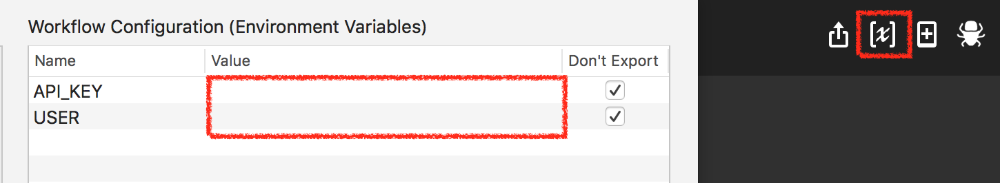

# bitly
Alfred workflow to shorten URL using bit.ly service

# Requirement
In order to use this workflow, APP_KEY and USER from the bit.ly service must be configured as shown in the following image.

